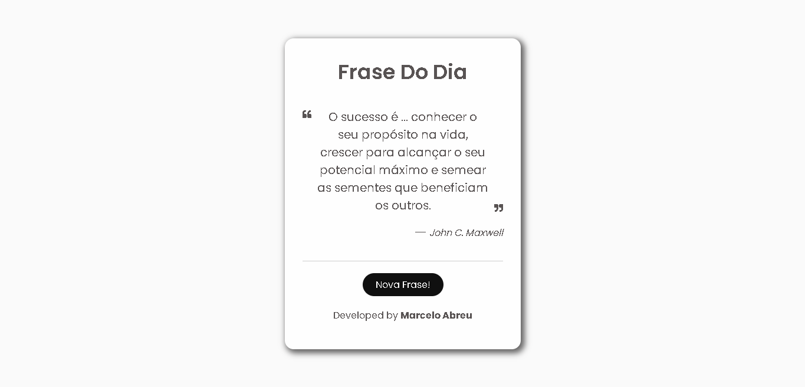

<h1 align="center">
 📨 Random Quote
</h1> 

 
 

Visualizar Projeto: [Clique aqui](https://Marcelo-Abreeu.github.io/Random-Quote/)

## 📝 Descrição

Neste projeto utilizei uma API com arquivos .JSON. 
As Frases são puxadas de forma dinâmica e mostradas ao usuário.
O mesmo retorna frases de forma aleatória com citações de grandes filósofos, empresários e jogadores de futebol.

## 🚀 Tecnologias

Esse projeto foi desenvolvido com as seguintes tecnologias:

- HTML
- CSS
- JavaScript

## 📚 Aprendizados 
- Criação de .JSON
- Consumos de API

-----

  <h3 align="center"> Developed by <a href="#">Marcelo Abreu</a> ☕</h3>

